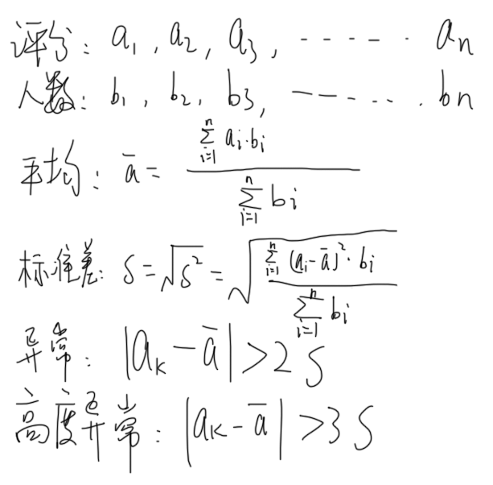

# 小德影城

## 评分算法​之排除异常评分

### 目前使用的方案：修改前端的评分。

计算方法：剔除异常值。异常值outlier：一组测定值中与平均值的偏差超过两倍标准差的测定值。与平均值的偏差超过三倍标准差的测定值，称为高度异常的异常值。 标准差：离均差平方的算术平均数（即：方差）的算术平方根。 计算1次后，剔除高度异常的异常值，再次计算平均数，确定为最终评分。

### **未来可能会使用的方案：**

1、计算用户的可信度，综合可信度计算加权评分。需要修改后端和数据库，所以可能要花比较长的时间。\
　参考的文档：EM算法：https://www.zhihu.com/question/54929748/answer/141779121

> 每个账号有一个恶意用户似然值，用来描述它属于恶意用户的概率，数值是概率的对数值。对每个作品的打分数据进行聚类，聚成若干个类型，对其中每个类型按照：聚类的特征（期望是否严重偏向于1或者5，方差大小），其中所有用户的恶意用户似然值的和等来判断这个分类是刷分的概率。再根据每个用户的所有打分中，属于的每个分类的刷分概率，重新计算恶意用户概率，反复迭代就可以得到比较准确的恶意用户似然值和分类的刷分概率。最后计算平均值的时候按该打分属于恶意刷分的概率加权。

2、条：「我建议你试试NMF，就跟Netflix最早最早那个用户聚类和推荐的方法一样，或者直接做个probabilistic PCA，然后聚个类，肉眼发现异常人」

关键词：非负矩阵 Netflix 聚类 推荐 异常
